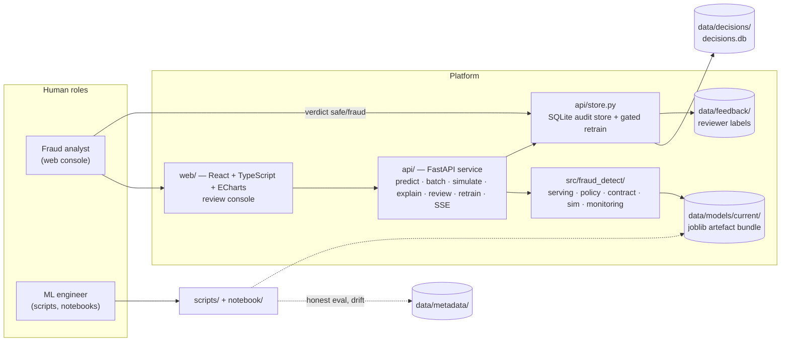
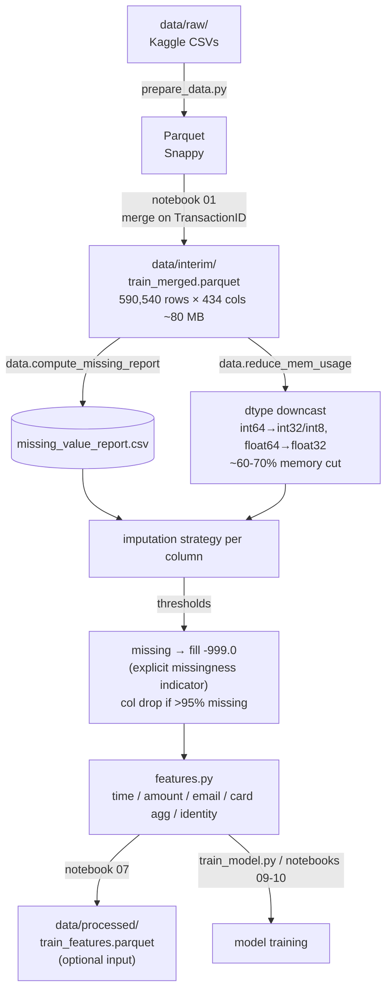
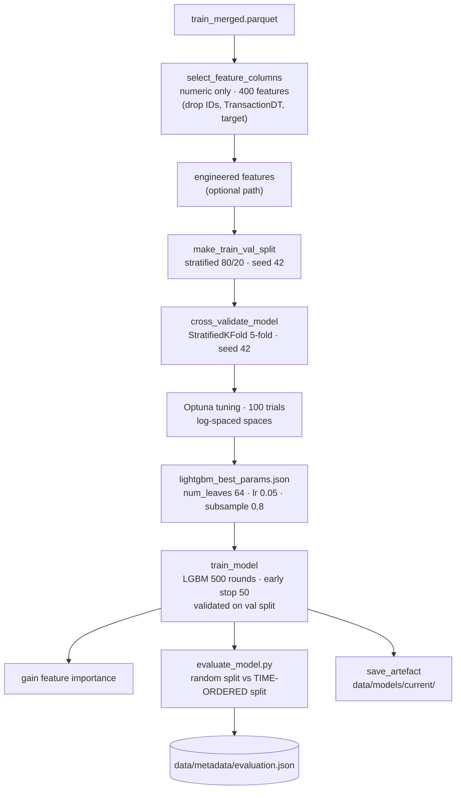
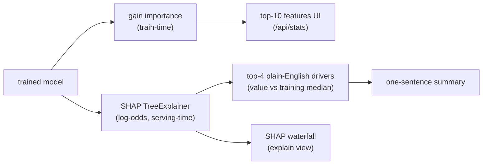
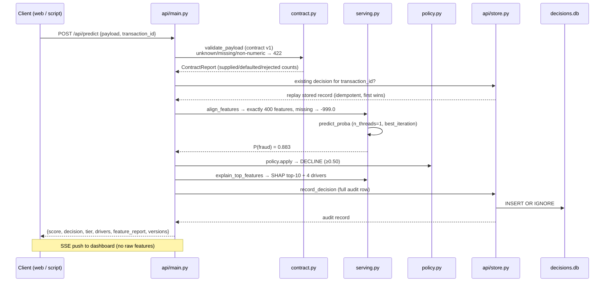
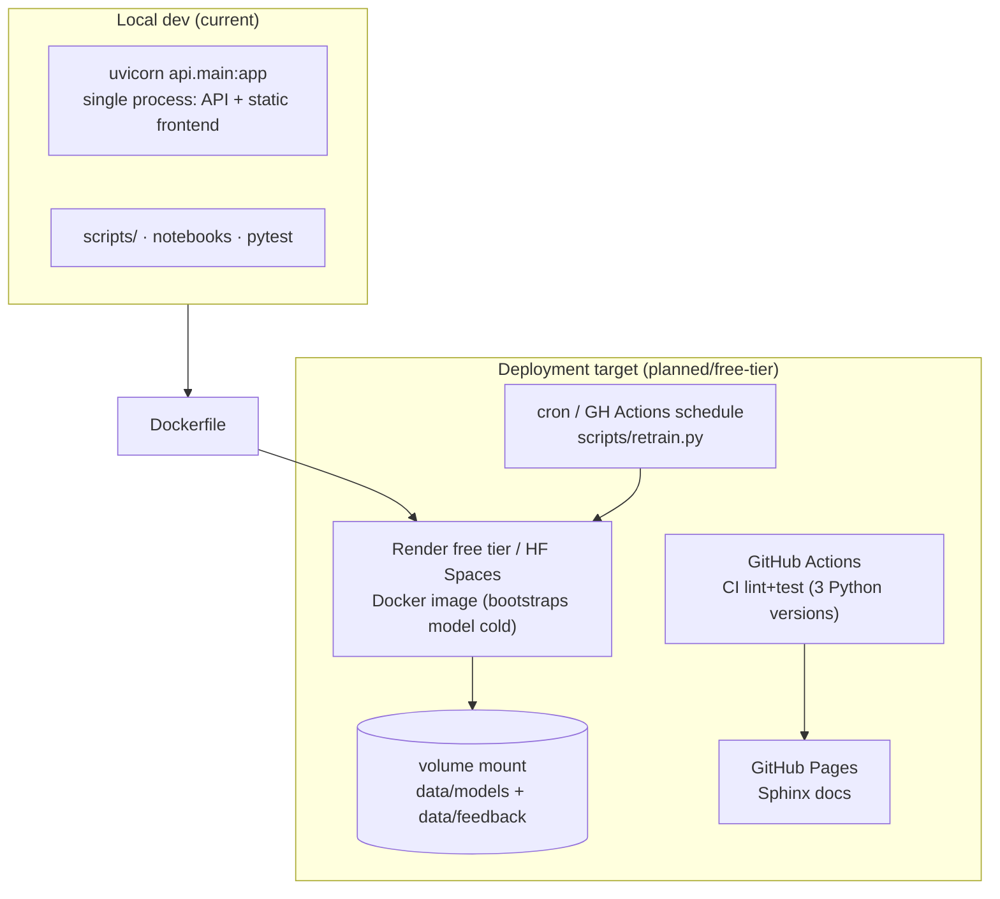

# Architecture — IEEE-CIS Fraud Detection Platform

> Bottom-up architecture reference. Every layer builds on the one below it,
> and nothing above a layer may reach past it. One rule keeps the system
> tidy: **all ML logic lives in `fraud_detect`, all HTTP logic lives in
> `api/`, all rendering lives in `web/`** — notebooks and scripts only
> orchestrate, they never reinvent.

---

## 1. Overview & tujuan sistem

### 1.1 Problem statement & business context

Online payment providers lose billions to fraudulent card transactions. The
operational reality for an issuing/fraud team is a **review queue**: an
automated model that flags the riskiest transactions so human analysts can
focus their attention, while low-risk transactions pass without review.

This platform answers: *"given one payment transaction, how likely is it
fraudulent, and what should the system do with it?"* The answer is a
probability (from a trained model), a **business decision** (APPROVE /
MANUAL_REVIEW / DECLINE, from a versioned policy), an **explanation** (SHAP
drivers in plain English), and a durable **audit record** — the last three
are what make it operationally usable beyond a raw score.

> **Portfolio / demo scope.** Built on the public IEEE-CIS / Vesta Kaggle
> competition dataset. **Not a production fraud system** — never use it for
> real payment decisions. See `docs/MODEL_CARD.md` for honest scope.

### 1.2 System context



### 1.3 Scope — done vs planned

| Area | Status | Detail |
|---|---|---|
| EDA + feature engineering | ✅ done | notebooks 01–08, engineered features in top predictors |
| Model training + tuning | ✅ done | LightGBM (tuned), XGBoost/CatBoost evaluated, Optuna |
| Ensembling | ✅ done | voting/stacking evaluated (not served — single tuned LightGBM served) |
| Honest evaluation | ✅ done | time-ordered split (ROC-AUC 0.909), full metric set |
| Serving API | ✅ done | real-time predict, batch CSV, scenario builder, explain |
| Web review console | ✅ done | 5 tabs, SSE live feed, review queue |
| Audit + feedback loop | ✅ done | SQLite decisions, reviewer verdicts, gated auto-retrain |
| Drift monitoring | 🟡 scaffolded | PSI + data-quality scripts exist; live alerts in service are future work |
| Recalibration tooling | ⏳ planned | model is only roughly calibrated; under-predicts at high risk |
| Label-based perf monitoring | ⏳ planned | **blocked** without a trusted live label source |
| Real-time prediction logging + drift alerts | ⏳ planned | service-side logging exists; alerting does not |
| Public demo deployment | ⏳ planned | requires approval — see `docs/DEPLOYMENT.md` |

### 1.4 Verified state (health check, 2026-08-14)

| Signal | Value |
|---|---|
| Test suite | **172 passed, 4 skipped**, coverage **87.28%** (CI gate ≥75%) |
| Lint (`ruff check`) | pass; 44/45 files ruff-formatted (1 WIP) |
| `/api/health` | `status=ok`, `model_present=true` |
| Served model | LightGBM `2026-08-06T08:15`, 400 features, 590,540 training rows |
| Contract enforcement | unknown field → 422; missing `TransactionDT` → 422; empty `values` → 422 |
| Scoring | 4-field payload → 0.883 DECLINE (396 fields auto-defaulted to −999) |
| Audit store | 100 decisions persisted, 2 reviewed |

---

## 2. Data

### 2.1 Sumber dataset

Provided by **Vesta Corporation** through the [IEEE-CIS Fraud Detection](https://www.kaggle.com/c/ieee-fraud-detection) Kaggle competition (2019). Not included in the repo — download to `data/raw/`.

| File | Rows | Description |
|---|---|---|
| `train_transaction.csv` | ~590K | transaction records + target (`isFraud`) |
| `train_identity.csv` | ~144K | device/identity signals, **~25% coverage** |
| `test_transaction.csv` | ~506K | unlabelled test transactions |
| `test_identity.csv` | ~133K | unlabelled test identity |

### 2.2 Data flow & preprocessing



### 2.3 Skema fitur (feature groups)

| Group | Columns | Description |
|---|---|---|
| Transaction | `TransactionAmt`, `ProductCD` | amount, product code |
| Card | `card1`–`card6` | card issuer/country codes, **counts, not real card data** |
| Address | `addr1`, `addr2`, `dist1`, `dist2` | billing addresses + distances |
| Email | `P_emaildomain`, `R_emaildomain` | purchaser/recipient domains |
| Count | `C1`–`C14` | counting features (address matches etc.) |
| Time delta | `D1`–`D15` | relative time features |
| Vesta | `V1`–`V339` | anonymised engineered features (uninterpretable by design) |
| Match | `M1`–`M9` | match flags |
| Identity | `id_01`–`id_38` | device/identity signals (sparse) |
| Device | `DeviceType`, `DeviceInfo` | device metadata |
| Target | `isFraud` | 0 = legitimate, 1 = fraud (~3.5%) |

### 2.4 Karakteristik masalah (kenapa model ini)

- **Class imbalance** — fraud rate ~3.5% (27:1). Accuracy is meaningless; ROC-AUC / PR-AUC / precision@capacity are the informative metrics.
- **High dimensionality** — 339 anonymous features + raw attributes.
- **Sparse identity** — identity table covers only ~25% of transactions.
- **Massive missingness** — many columns >50% missing; per-column strategy.
- **Relative timestamps** — `TransactionDT` in seconds from unknown origin; `TRANSACTION_DT_START = 2017-12-01` anchors calendar features.

---

## 3. Model utama (LightGBM)

### 3.1 Pilihan model

**Served model: tuned LightGBM (gradient-boosted trees).** Rationale: best
balance of speed, memory, and ranking quality on wide, sparse, highly missing
tabular data; native NaN handling (missing = −999 is respected as a branch
feature); single-threaded inference keeps the API cheap. XGBoost and CatBoost
were trained and compared (notebooks 09–12); ensembles (voting/stacking) were
evaluated and rejected as the served model because the gain did not justify
the serving complexity.

### 3.2 Training pipeline



### 3.3 Split & cross-validation strategy

| Mechanism | Design | Used for |
|---|---|---|
| `make_train_val_split` | stratified 80/20, `random_state=42` | training/validation during dev |
| `cross_validate_model` | StratifiedKFold 5-fold, shuffled, seed 42 | backend comparison, robustness |
| **Time-ordered split** | first 80% of `TransactionDT` window trains, last 20% validates | **headline honest evaluation** |

> **Why two regimes?** A random split scores 0.954 — inflated by temporal
> leakage (the model memorises time-correlated signal). The leakage-resistant
> benchmark, **ROC-AUC 0.909 on the time-ordered split**, is the only number
> used as the honest result. `evaluate_model.py` reports both, labelled.

### 3.4 Hyperparameter

Base (`config.py`, served unless tuned params merged):

```json
{ "objective": "binary", "metric": "auc", "num_leaves": 31, "learning_rate": 0.1,
  "feature_fraction": 0.8, "bagging_fraction": 0.8, "bagging_freq": 5,
  "min_child_samples": 20, "reg_alpha": 0.0, "reg_lambda": 0.0,
  "verbose": -1, "random_state": 42 }
```

Optuna-tuned (merged at train time by `train_model.py`):
`num_leaves: 64`, `learning_rate: 0.05`, `subsample: 0.8`.

Training budget: `num_boost_round=500`, `early_stopping=50` rounds on the val
split. Optuna spaces per backend (`num_leaves` 16–256, `learning_rate`
0.01–0.3 log, regularisation 1e-8–10 log, …) in `config.py`.

### 3.5 Evaluasi lengkap (reproducible from `data/metadata/evaluation.json`)

| Metric | Time-ordered (honest) | Random split (inflated) |
|---|---|---|
| **ROC-AUC** | **0.909** | 0.954 |
| PR-AUC | 0.562 | 0.773 |
| Brier score | 0.021 | 0.014 |
| Precision @ 0.5 | 0.824 | 0.934 |
| Recall @ 0.5 | 0.360 | 0.531 |
| Precision @ 0.15 (review tier) | 0.542 | 0.695 |
| Recall @ 0.15 (review tier) | 0.535 | 0.724 |
| Precision @ top 1% riskiest | 0.899 | 0.987 |
| Precision @ top 5% riskiest | 0.414 | 0.543 |
| Fraud rate in validation | 3.44% | 3.50% |
| Validation size | 118,108 | 118,108 |

**Confusion matrices (minority-class focus, time-ordered split):**

| Threshold | TN | FP | FN | TP |
|---|---|---|---|---|
| 0.15 (review) | 112,206 | 1,838 | 1,891 | **2,173** |
| 0.50 (decline) | 113,732 | 312 | 2,600 | **1,464** |

At the 0.15 review threshold the model flags ~3.4% of transactions and
catches ~53% of fraud — a realistic operating point for a human review queue.

**Calibration caveat:** roughly calibrated only (Brier 0.021). Top decile
under-predicts: mean prediction 0.225 vs actual 0.251. **Treat output as a
risk ranking, not a calibrated likelihood**, unless recalibrated.

**Segment ROC-AUC (time-ordered):** identity present 0.919 / absent 0.877 ·
validation early 0.916 / late 0.902 · amount ≥ median 0.898 / < median 0.919.
No material degradation across the validation window.

### 3.6 Feature importance & SHAP



Top features (gain): `V258` (7,353) · `C1` (2,483) · `TransactionAmt` (2,446)
· `card1` (2,279) · `C14` (2,236) · `card2` (2,096) · `C13` (1,825) · `D2`
(1,553) · `addr1` (1,495) · `V294` (1,248). Engineered features
(`amt_vs_addr_mean`, `card1_amt_mean`) rank among the strongest — validating
the engineering stage. SHAP degrades gracefully to empty lists if `shap` is
not installed.

---

## 4. Serving / inference flow saat ini

**Already live, not notebook-only.** The model is served in three modes:

| Mode | Entry point | Characteristic |
|---|---|---|
| **Real-time API** | `POST /api/predict` | one raw payload → probability + decision + SHAP, idempotent, audited |
| **Batch API** | `POST /api/predict/batch` | CSV upload → per-row scores/decisions, download scored CSV |
| **Local scripts** | `scripts/*.py`, `uvicorn api.main:app` | training, evaluation, drift, retrain; demo stream replay |

### 4.1 Scoring path (all modes converge)



### 4.2 Endpoints

| Method | Path | Purpose |
|---|---|---|
| GET | `/api/health` · `/api/model` | status, model metadata |
| GET | `/api/stats` | dataset overview + top-10 features (UI) |
| POST | `/api/predict` · `/api/predict/batch` | single / CSV batch scoring |
| POST | `/api/simulate` · GET `/api/sim/fields` | demo scenario builder |
| POST | `/api/explain` | SHAP + plain-English summary |
| GET/POST | `/api/review/queue` · `/api/review/{id}` · `/api/review/{id}/outcome` | analyst queue → feedback pool |
| GET | `/api/monitor/summary` | decision aggregates |
| POST | `/api/feedback` | legacy label endpoint |
| POST | `/api/retrain` | gated retrain (admin key) |
| GET | `/api/decisions/stream` | SSE live feed |

### 4.3 Persistence semantics

- **Audit store**: SQLite `decisions` (id, transaction_id unique, score,
  decision, action, model/contract/policy versions, thresholds, reason codes,
  feature report, input features, status, reviewer outcome, notes) + feedback
  table mirroring `data/feedback/feedback.jsonl`.
- **Idempotency**: keyed by `transaction_id` (`INSERT OR IGNORE`, first
  decision wins; replays return stored record).
- **Retrain gate**: candidate replaces `current/` **only if**
  `new_auc ≥ old_auc` on the same held-out split; losers archived under
  `candidates/rejected_<ts>/`. Anti-regression by construction.

---

## 5. Infrastruktur & tech stack

### 5.1 Stack (from `pyproject.toml`)

| Category | Tools |
|---|---|
| **Language** | Python **3.10+** (CI: 3.10 / 3.11 / 3.12) |
| **Data** | pandas ≥2.0, numpy ≥1.24, pyarrow ≥14.0 |
| **ML** | lightgbm ≥4.0 (served) · xgboost ≥2.0, catboost ≥1.2 (extras) · scikit-learn ≥1.3 |
| **Tuning** | Optuna (TPE, seeded; 100 trials; study persisted to `optuna_study.db`) |
| **Service** | FastAPI ≥0.110, uvicorn ≥0.29, python-multipart |
| **Explainability** | shap ≥0.44 (optional at runtime) |
| **Frontend** | React 19 + TypeScript + Vite · ECharts · Zustand · TanStack Query |
| **Storage** | Parquet (Snappy) for data · SQLite for decisions/feedback · JSON metadata |
| **Testing / QA** | pytest + pytest-cov + Hypothesis · ruff (E,F,I,N,W,UP,B,SIM,ARG,PL) + pre-commit |
| **Docs** | Sphinx + furo + myst-parser |

### 5.2 Deployment topology



**Database**: SQLite (`data/decisions/decisions.db`) — a deliberate choice for
a single-process demo; swap for PostgreSQL when multi-instance is needed.
Raw payloads live only in SQLite (never stdout/SSE).

**Deployment**: currently runs locally; free-tier targets (Render / HF
Spaces) documented in `docs/DEPLOYMENT.md`. Docker image bootstraps a model
from bundled training data so it responds on cold start.

---

## 6. Struktur folder/kode project

```mermaid
flowchart TD
    ROOT["ieee-fraud-detection/"] --> SRC["src/fraud_detect/ — core package<br/>(all ML logic, no FastAPI imports)"]
    ROOT --> API["api/ — FastAPI<br/>main.py (routes) · store.py (audit+gate) · schemas.py"]
    ROOT --> WEB["web/ — index.html · app.js · style.css · live.js"]
    ROOT --> SCR["scripts/ — train · evaluate · retrain · drift · stream · prepare"]
    ROOT --> NB["notebook/ — 15 ordered notebooks (01–15)"]
    ROOT --> TESTS["tests/ — 100+ pytest + Hypothesis + Node (live.js)"]
    ROOT --> DOCS["docs/ — MODEL_CARD · DEMO · DEPLOYMENT · Sphinx source"]
    ROOT --> DATA["data/ — raw · interim · processed · metadata · models · decisions · feedback"]
    ROOT --> DASH["dashboard/data/ — committed CSVs + demo sample.parquet"]

    SRC --> CFG["config.py — paths, columns, hyperparams, tuning spaces"]
    SRC --> IO["io.py — parquet/csv, load_train_features"]
    SRC --> DAT["data.py — dtype downcast, missingness, imputation"]
    SRC --> FEAT["features.py — time/amount/email/card/identity transforms"]
    SRC --> MOD["models.py — split, logistic, LGBM/XGB/CB, CV"]
    SRC --> TUN["tuning.py — Optuna spaces, param persistence"]
    SRC --> ENS["ensemble.py — voting + stacking"]
    SRC --> EVAL["evaluation.py — metrics, Youden threshold, McNemar"]
    SRC --> ERR["error_analysis.py — segments, shift, FP/FN, amount bins"]
    SRC --> VIZ["viz.py — 18 plotting helpers"]
    SRC --> SERV["serving.py — artefact, alignment, predict, SHAP, summaries"]
    SRC --> POL["policy.py — versioned decision policy"]
    SRC --> CONT["contract.py — strict input schema v1"]
    SRC --> SIM["sim.py — demo scenario builder"]
    SRC --> MON["monitoring.py — PSI + data quality"]
    SRC --> EXC["_exceptions.py — domain errors"]
```



**Layering contract** (enforced by import hygiene + tests):

| Layer | Contains | May import |
|---|---|---|
| Core | `fraud_detect/*` | stdlib, third-party ML libs, itself |
| Service | `api/*` | core, FastAPI |
| Frontend | `web/*` | only the API (JSON/SSE) |
| Orchestration | `scripts/`, `notebook/` | core + API |
| QA | `tests/*`, `.github/workflows` | everything (tests only) |

New features plug in at exactly one place: model logic → core module,
endpoint → `api/main.py` + `schemas.py`, persistence/gate → `api/store.py`,
UI → `web/src` (React + TanStack Query + Zustand). This is the intended
extension surface.

---

## 7. Constraint & keterbatasan

### 7.1 Compute & budget

| Constraint | Reality |
|---|---|
| Compute | CPU-only; **no GPU** anywhere (local + CI + free-tier deploy) |
| Full-data LightGBM run | ~minutes (590K rows × 400 numeric features, 500 rounds early-stopped) |
| Demo bootstrap | ~1 min on committed `sample.parquet` (12.6 MB) |
| Budget for paid APIs | none — free tier only (Render/HF Spaces sleep on idle → cold starts) |
| CI | GitHub Actions free tier; full test suite must stay lightweight |

### 7.2 Data constraints

- Data from **2017–2018** Vesta contest — likely outdated vs 2026 fraud patterns; benchmark, not live system.
- ~3.5% fraud (27:1) — PR/precision@capacity, never accuracy.
- Sparse identity (~25% coverage), many columns >50% missing.
- Anonymised `V1–V339` features uninterpretable — only a subset of features can be explained in plain language.
- `card1–card6` are issuer/country **counts**, not real card data.
- No external dataset merged (feature spaces incompatible — `docs/EXTERNAL_DATA.md`).

### 7.3 Model constraints

- Only roughly calibrated (Brier 0.021); under-predicts in top decile.
- Random-split numbers (0.954) are leakage-inflated; only time-ordered (0.909) are trustworthy.
- No forward test on live data; validation is one point in time.
- SHAP optional — without `shap` installed, explanations degrade to empty.

### 7.4 Operational constraints

- Rate limiting is **per-process, demo-grade** (300 req/min/IP, fixed window); fine for a single uvicorn process.
- Retrain gate requires `FRAUD_API_ADMIN_KEY` to be meaningfully protected.
- **No live labels** — label-based performance monitoring is blocked by design until a trusted label source exists.
- Single-process architecture: SQLite + in-memory model handle; scaling out needs Postgres + object storage (documented as future work).

### 7.5 Waktu untuk fitur baru

Repo is a **portfolio demo on a side-project cadence** — no hard deadline;
work lands incrementally as tested, linted PRs. Relative effort estimates:

| Candidate feature | Effort | Pre-requisite |
|---|---|---|
| Drift alerts in the service (threshold + SSE push) | S | none (PSI logic exists) |
| Recalibration + threshold-setting tooling | M | none (script-based) |
| Live prediction logging (features + labels schema) | M | storage decision |
| Label-based performance monitoring | M | trusted label source (blocked) |
| Public demo deployment | S–M | approval, secrets, volume wiring |

---

## Reference map

| Question | Go to |
|---|---|
| Where is the logic for X? | `src/fraud_detect/<module>.py` |
| How does an endpoint behave? | `api/main.py` + `api/schemas.py` |
| How is a decision stored / retrained? | `api/store.py` |
| Why these metrics / what does the model claim? | `docs/MODEL_CARD.md`, `data/metadata/evaluation.json` |
| How do I run everything? | `README.md`, `Makefile`, `docs/DEMO_WALKTHROUGH.md` |
| How do I deploy? | `docs/DEPLOYMENT.md`, `Dockerfile`, `render.yaml` |
| What changed? | `CHANGELOG.md` |
